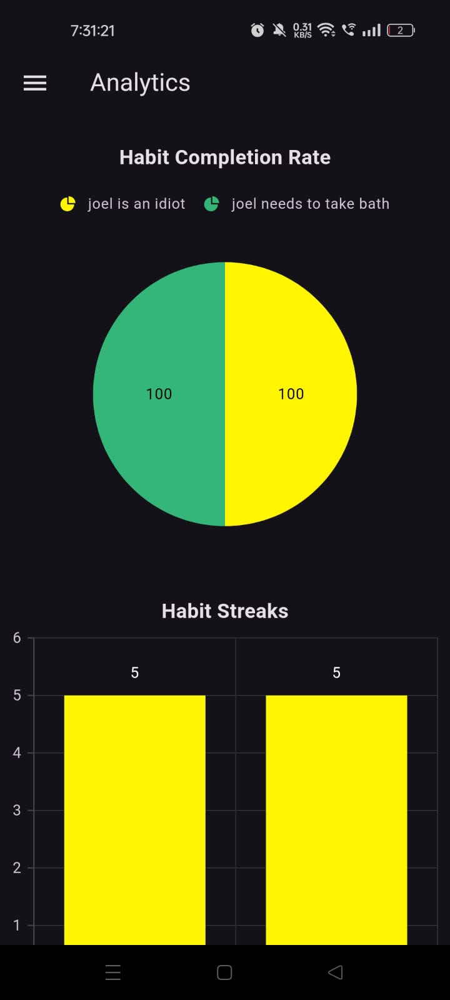
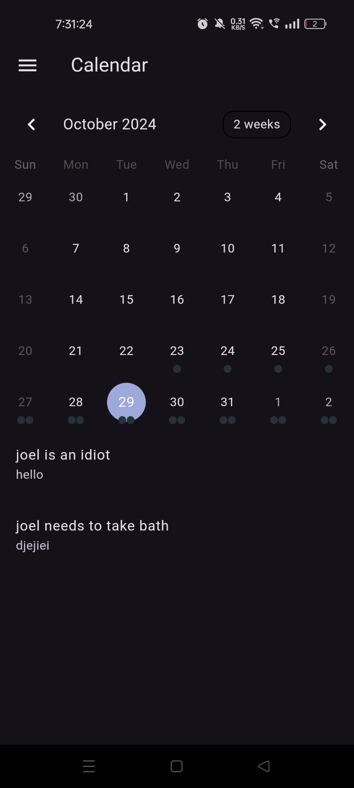
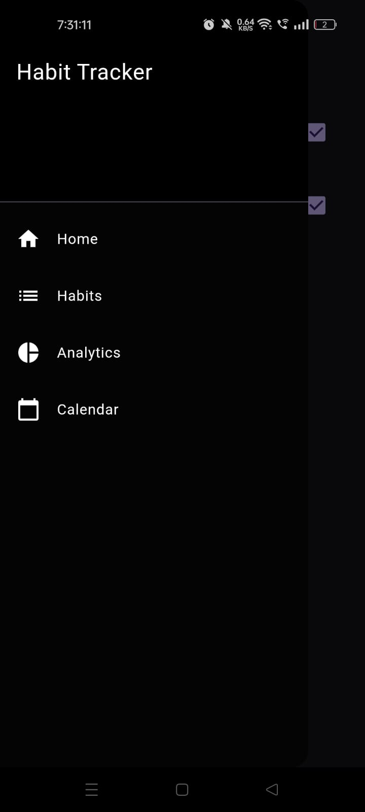

# Habit Tracker App

A Flutter application designed to help users track and manage their habits efficiently. The app boasts a modern dark theme UI, seamless navigation, and robust functionality powered by sqflite and Syncfusion charts.

## Table of Contents

- [Features](#features)
- [Screenshots](#screenshots)
- [Getting Started](#getting-started)
  - [Prerequisites](#prerequisites)
  - [Installation](#installation)
- [Usage](#usage)
- [Technologies Used](#technologies-used)
- [Project Structure](#project-structure)
- [Contributing](#contributing)
- [License](#license)

---

## Features

- **Dark Theme Interface**: Provides a sleek and modern user interface that's easy on the eyes.
- **Sidebar Navigation**: Quick access to all main sections:
  - Home
  - Habits
  - Analytics
  - Calendar
- **Habit Management**:
  - Add new habits with details like name, description, start date, and end date.
  - View a list of all habits.
  - Mark habits as completed.
  - Delete habits.
- **Analytics Dashboard**:
  - Visualize habit completion rates using Syncfusion circular charts.
  - View habit streaks with Cartesian charts.
- **Calendar View**:
  - Display habits on a calendar to see when they are scheduled.
  - View habits for a selected day.
- **Local Storage**:
  - Data persistence using sqflite, ensuring habits and progress are saved locally.

---

## Screenshots

1. **Home Screen**

   

2. **Habits Screen**

   

3. **Add Habit Screen**

   

4. **Analytics Screen**

   

5. **Calendar Screen**

   

6. **Sidebar**

   

---

## Getting Started

### Prerequisites

- **Flutter SDK**: Ensure you have Flutter installed. You can download it from the [official website](https://flutter.dev/docs/get-started/install).
- **Dart SDK**: Comes bundled with Flutter.
- **IDE**: Preferably [Android Studio](https://developer.android.com/studio) or [Visual Studio Code](https://code.visualstudio.com/) with Flutter and Dart plugins installed.

### Installation

1. **Clone the Repository**

   ```bash
   git clone https://github.com/yourusername/habit_tracker_app.git
   cd habit_tracker_app
   ```

2. **Fetch Dependencies**

   Run the following command to install all necessary packages:

   ```bash
   flutter pub get
   ```

3. **Run the App**

   Connect a device or start an emulator, then run:

   ```bash
   flutter run
   ```

---

## Usage

- **Home Screen**: View today's habits and mark them as completed.
- **Habits Screen**:
  - **Add Habit**: Tap the '+' button to add a new habit.
  - **Delete Habit**: Tap the trash icon to remove a habit.
  - **Mark as Completed**: Use the checkbox to mark habits as completed.
- **Analytics Screen**: View charts representing habit completion rates and streaks.
- **Calendar Screen**: Navigate through the calendar to see habits scheduled on specific dates.

---

## Technologies Used

- **Flutter**: UI toolkit for building natively compiled applications.
- **Dart**: Programming language optimized for building user interfaces.
- **sqflite**: SQLite plugin for Flutter, used for local data storage.
- **Syncfusion Flutter Charts**: For data visualization and charts.
- **Table Calendar**: Widget to display a calendar view.
- **Path Provider**: Used to find commonly used locations on the filesystem.
- **Intl**: Internationalization and localization facilities.

---

## Project Structure

```
lib
├── main.dart                  # Entry point of the application
├── sidebar.dart               # Sidebar navigation widget
├── models
│   └── habit.dart             # Habit data model
├── database_helper.dart       # Database helper class for sqflite operations
├── screens
    ├── home_screen.dart       # Home screen
    ├── habits_screen.dart     # Habits management screen
    ├── add_habit_screen.dart  # Screen to add new habits
    ├── analytics_screen.dart  # Analytics and charts screen
    └── calendar_screen.dart   # Calendar view screen
```

---

## Contributing

Contributions are welcome! If you'd like to contribute to this project, please follow these steps:

1. **Fork the Repository**

   Click on the 'Fork' button at the top right corner of the repository page.

2. **Clone Your Fork**

   ```bash
   git clone https://github.com/yourusername/habit_tracker_app.git
   ```

3. **Create a New Branch**

   ```bash
   git checkout -b feature/YourFeatureName
   ```

4. **Make Your Changes**

   Implement your feature or fix the issue.

5. **Commit Your Changes**

   ```bash
   git commit -m "Description of your changes"
   ```

6. **Push to Your Fork**

   ```bash
   git push origin feature/YourFeatureName
   ```

7. **Submit a Pull Request**

   Go back to the original repository and create a pull request from your forked repository.

---

## License

This project is licensed under the MIT License

---

## Contact

If you have any questions or suggestions, feel free to reach out:

- **Email**: chrisjaron99@gmail.com
- **GitHub**: [ZERO2k21](https://github.com/ZERO2k21)

---

## Acknowledgments

- **Flutter Community**: For providing extensive documentation and support.
- **Syncfusion**: For the powerful charting library.
- **Open-Source Packages**: Thanks to all the package maintainers and contributors.

---

## Notes

- Ensure you have the latest version of Flutter and Dart to avoid compatibility issues.
- This app is intended for educational purposes as part of a college project.
- The app currently does not include user authentication or cloud storage.

---

**Disclaimer**: This README is a template and should be customized with actual screenshots, correct repository links, contact information, and any additional details specific to your project.
